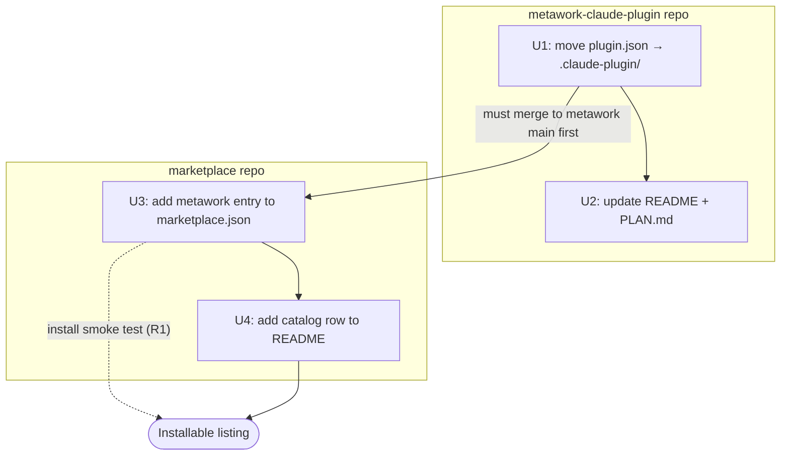
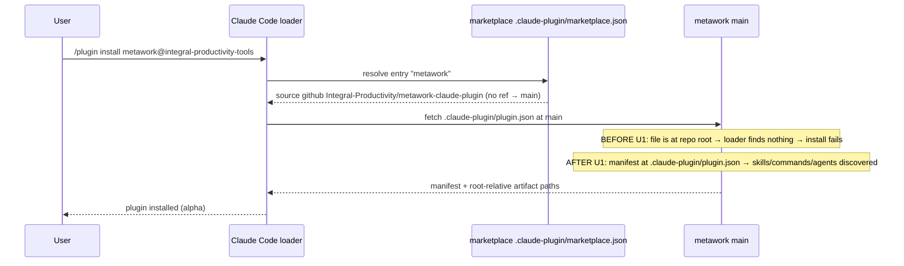

# feat: List the metawork plugin in the Integral Productivity marketplace

## Summary

List the `metawork` Claude Code plugin in the public Integral Productivity marketplace so users can install it via `/plugin install metawork@integral-productivity-tools`. Listing is three coupled pieces, not one: a `marketplace.json` entry plus README catalog row in **this repo**, gated by a structural fix in the **metawork repo** (its manifest currently lives at the repo root, where Claude Code's loader cannot find it). Per the scoping decisions, the marketplace entry tracks metawork's `main` branch on an interim basis (matching the `model-framework-integration` precedent rather than the tag-driven `stable` channel), and metawork is listed now with its description flagging alpha/preview status even though its skill/command/agent bodies are still stubs.

**Cross-repo plan.** The plan document lives in `Integral-Productivity/marketplace`. Units U1–U2 target the `metawork-claude-plugin` repo; units U3–U4 target this `marketplace` repo. All file paths below are repo-relative to the unit's target repo.

---

## Problem Frame

"Add the metawork plugin to the marketplace" sounds like a one-line edit, but a marketplace entry alone produces a **non-installable listing**. Claude Code's plugin loader resolves a marketplace `source` to a repo+ref and then looks for `.claude-plugin/plugin.json` at that location. metawork's manifest is at its **repo root** (`plugin.json`), so the loader would find no manifest and the install would fail. Both already-listed plugins that have manifests (`holacracy`, `model-framework-integration`) keep them at `.claude-plugin/plugin.json`; metawork is the outlier.

The marketplace README's "Adding a plugin" section also prescribes a tag-driven `stable` channel as the standard. metawork has no `stable` branch, no tags, and no promotion workflow, and is genuinely alpha (`0.1.0-alpha`, stubbed bodies). Forcing it onto the `stable` channel would mean cutting a release of a stubbed plugin. The interim decision is to track `main` (a precedent the README already grandfathers for `model-framework-integration`), and migrate to the `stable` channel later when metawork cuts a real release.

So the real problem is: **make metawork loadable, then list it correctly for its current maturity, without overstating that maturity to users.**

---

## Requirements

- **R1 — Installable listing.** After this work, `/plugin install metawork@integral-productivity-tools` from `integral-productivity-tools` resolves to a plugin Claude Code can load (skills, commands, agents discovered).
- **R2 — Manifest conformance.** metawork's manifest lives at `.claude-plugin/plugin.json` and its declared `skills`/`commands`/`agents` paths still resolve from the plugin root after the move.
- **R3 — Interim channel.** The marketplace entry tracks metawork `main` (no `ref` field), following the `model-framework-integration` shape, with no `version` field (the plugin's own manifest is the version source of truth).
- **R4 — Honest maturity signal.** The catalog and entry description flag metawork as alpha/preview so users understand bodies are still being filled in.
- **R5 — No drift in metawork's own docs.** metawork's `README.md` and `PLAN.md` reflect the new manifest location and the now-published-to-marketplace state.
- **R6 — Migration path recorded.** The deferred move to the `stable` channel is captured as tracked follow-up work, not lost.

---

## Key Technical Decisions

- **KTD1 — Track `main`, not `stable`, for now.** The entry omits `ref` (Claude Code defaults to the repo's default branch). Rationale: metawork is alpha with stubbed bodies; the `stable` channel implies a tag-driven release of vetted code, which would be premature. `model-framework-integration` is already listed this way, so the shape is precedented. Trade-off: users on `main` get unvetted changes immediately — acceptable for an explicitly alpha/preview listing, and the description says so. (Decision confirmed with user, 2026-06-05.)
- **KTD2 — Move the manifest, keep the explicit arrays.** metawork's `plugin.json` explicitly lists `skills`/`commands`/`agents` with root-relative paths. holacracy instead relies on directory auto-discovery (no arrays). The minimal, lowest-risk change is to **move the file unchanged** into `.claude-plugin/`; manifest paths resolve from the plugin root (`${CLAUDE_PLUGIN_ROOT}` = repo root) regardless of where the manifest file sits, so `skills/metawork-scholar` still resolves correctly. Converting to auto-discovery is a scope-adjacent cleanup, deferred (see Scope Boundaries).
- **KTD3 — No `version` field on the marketplace entry.** Per the marketplace README, the entry tracks a channel and the plugin's `.claude-plugin/plugin.json` is the version source of truth. Matches `lean-management` and `holacracy`.
- **KTD4 — Verify by real install, not by schema.** This repo has no `marketplace.json` validator in CI (only the Claude GitHub-app workflows run). Correctness is proven by a `jq` parse plus an actual `/plugin marketplace add` + `/plugin install` smoke test against `main`.

---

## High-Level Technical Design

**Cross-repo merge ordering** — the metawork manifest fix must land on metawork `main` before the marketplace entry is functional, because the entry tracks `main` live:



**Install resolution path** — what the loader does once both sides have merged, and why U1 is the gate:



These diagrams render authoritative ordering, not a sketch: U3 must not merge to marketplace `main` until U1 is on metawork `main`.

---

## Output Structure

New directory created in the metawork repo (U1):

```text
metawork-claude-plugin/
└── .claude-plugin/
    └── plugin.json        # moved verbatim from repo root
```

No new directories in the marketplace repo — U3/U4 edit existing files.

---

## Implementation Units

### U1. Move metawork manifest to `.claude-plugin/plugin.json`

- **Goal:** Make metawork loadable by Claude Code by relocating its manifest to the conventional path, without altering its declared artifacts.
- **Target repo:** `Integral-Productivity/metawork-claude-plugin`
- **Requirements:** R1, R2
- **Dependencies:** none
- **Files:**
  - `.claude-plugin/plugin.json` (create — content moved verbatim from root)
  - `plugin.json` (delete from repo root)
- **Approach:** `git mv plugin.json .claude-plugin/plugin.json`. Do not edit the `skills`/`commands`/`agents` arrays — they are root-relative and resolve from the plugin root, which is unchanged by the move (KTD2). Keep `version: 0.1.0-alpha` as-is; this unit is structural, not a release.
- **Patterns to follow:** `holacracy-claude-plugin/.claude-plugin/plugin.json` and `model-framework-integration/.claude-plugin/plugin.json` (both at `.claude-plugin/`).
- **Test scenarios:**
  - `jq empty .claude-plugin/plugin.json` exits 0 (manifest is valid JSON after the move).
  - Repo root no longer contains `plugin.json` (`test ! -f plugin.json`).
  - Each path in `skills`/`commands`/`agents` resolves to an existing file/dir from the repo root (e.g. `skills/metawork-scholar`, `commands/metawork-set-up.md`, `agents/metawork-scholar.md` all exist).
  - Covers R1/R2 (integration). Local install from the metawork working copy (`/plugin` against the local path, or `claude plugin validate` if available) discovers all six skills, five commands, and two agents — proving manifest paths still resolve after relocation. This is the scenario mocks cannot prove; it must run against a real loader.
- **Verification:** Claude Code loads the plugin from a local checkout and lists its skills/commands/agents with no "manifest not found" or unresolved-path errors.

### U2. Update metawork README and PLAN.md for the new location and published state

- **Goal:** Keep metawork's own docs truthful after U1 and after listing — no stale "not yet published" text, no stale root-`plugin.json` references.
- **Target repo:** `Integral-Productivity/metawork-claude-plugin`
- **Requirements:** R4, R5
- **Dependencies:** U1
- **Files:**
  - `README.md` (install section ~lines 37, 45)
  - `PLAN.md` (release step referencing `plugin.json`, ~line 254)
- **Approach:** In `README.md`, replace the "isn't yet published / install instructions will land" note with the marketplace install path (`/plugin marketplace add Integral-Productivity/marketplace` + `/plugin install metawork@integral-productivity-tools`), and state plainly that it is **alpha/preview** (bodies still being filled in). In `PLAN.md`, update the v0.1.0 release step so the `plugin.json` reference points at `.claude-plugin/plugin.json`, preserving the existing `0.1.0-alpha → 0.1.0` version-bump intent.
- **Patterns to follow:** Install snippet in this marketplace repo's `README.md` (Install section).
- **Test scenarios:** `Test expectation: none -- documentation-only unit, no behavioral change.` Verification is reviewer confirmation that no remaining text claims metawork is unpublished or that the manifest is at the repo root.
- **Verification:** `grep -n "isn't yet published\|will land" README.md` returns nothing; `grep -rn "\bplugin.json" PLAN.md` shows only `.claude-plugin/plugin.json` references.

### U3. Add the metawork entry to `marketplace.json`

- **Goal:** List metawork on the interim `main`-tracking channel so it becomes installable once U1 is merged.
- **Target repo:** `Integral-Productivity/marketplace`
- **Requirements:** R1, R3, R4
- **Dependencies:** U1 (must be merged to metawork `main` before this merges — see sequencing in System-Wide Impact)
- **Files:**
  - `.claude-plugin/marketplace.json`
- **Approach:** Append one object to the `plugins` array, shaped like the `model-framework-integration` entry (which tracks `main`): `name: "metawork"`, `source: { "source": "github", "repo": "Integral-Productivity/metawork-claude-plugin" }` with **no `ref`** and **no `version`**. Description flags alpha/preview, e.g. *"(Alpha/preview) Teach, run, set up, and coach the Meta Work methodology — structured intentional planning, perspective-maintenance, and monitoring across project, area, domain, and identity scopes."*
- **Patterns to follow:** The `model-framework-integration` entry in the same file (no `ref`); the `holacracy` description style.
- **Test scenarios:**
  - `jq empty .claude-plugin/marketplace.json` exits 0 (valid JSON).
  - `jq '.plugins[] | select(.name=="metawork") | .source.repo' .claude-plugin/marketplace.json` returns `Integral-Productivity/metawork-claude-plugin`.
  - The metawork entry has **no** `ref` key and **no** `version` key (`jq '.plugins[] | select(.name=="metawork") | has("version")'` is `false`; same for a `.source.ref` check).
  - Covers R1 (integration). After U1 and U3 are both on their repos' `main`: `/plugin marketplace add Integral-Productivity/marketplace` then `/plugin install metawork@integral-productivity-tools` installs and the plugin's skills/commands/agents appear. The blocking precondition (U1 merged) is what this scenario validates end-to-end.
- **Verification:** End-to-end install from `main` succeeds; the plugin loads its artifacts.

### U4. Add the metawork row to the marketplace README catalog

- **Goal:** Keep the human-readable catalog in sync with `marketplace.json`.
- **Target repo:** `Integral-Productivity/marketplace`
- **Requirements:** R4, R5
- **Dependencies:** U3
- **Files:**
  - `README.md` (Catalog table)
- **Approach:** Add one table row: ``| `metawork` | [Integral-Productivity/metawork-claude-plugin](https://github.com/Integral-Productivity/metawork-claude-plugin) | (Alpha/preview) Teach, run, set up, and coach the Meta Work methodology across project, area, domain, and identity scopes |``. Match the existing column order and the alpha/preview wording used in U3 so the table and JSON agree.
- **Patterns to follow:** The existing three catalog rows in `README.md`.
- **Test scenarios:** `Test expectation: none -- documentation-only unit.` Verification is reviewer confirmation that the README row's description matches the U3 `marketplace.json` description (no divergence between catalog and manifest).
- **Verification:** Catalog row present, description wording matches the `marketplace.json` entry.

---

## Scope Boundaries

**In scope:** the manifest relocation (U1), metawork doc updates (U2), the marketplace entry (U3), the catalog row (U4), and the end-to-end install verification.

### Deferred to Follow-Up Work

- **Migrate metawork to the tag-driven `stable` channel.** When metawork reaches a real (non-prerelease) release, add a `promote-stable.yml` workflow (template: `holacracy-claude-plugin/.github/workflows/promote-stable.yml`), cut a `vX.Y.Z` tag, and change this entry's `source` to include `"ref": "stable"`. Touches both repos. (Realizes R6.)
- **Record the channel decision as a metawork ADR.** metawork has `.adr-dir` initialized; the track-`main`-interim-then-`stable` decision is ADR-worthy in that repo.
- **Simplify metawork's manifest to directory auto-discovery.** Drop the explicit `skills`/`commands`/`agents` arrays and rely on convention (as holacracy does). Scope-adjacent cleanup; not required for listing.
- **metawork body implementation.** Filling in the stubbed skill/command/agent bodies is metawork's own roadmap (its PLAN.md), out of scope for listing.

### Out of scope

- Any change to `lean-management`, `model-framework-integration`, or `holacracy` entries.
- Initializing ADR tooling or `STRATEGY.md` in the marketplace repo (CE is configured but neither is set up; not required for this work).

---

## System-Wide Impact

- **Cross-repo merge ordering (load-bearing).** Because the entry tracks `main` live, U1 must be on metawork `main` **before** U3 merges to marketplace `main`. If U3 merges first, users who refresh the marketplace get an entry that resolves to a metawork `main` whose manifest is still at the root → install failure for the window between the two merges. Serialize: merge U1 (and ideally U2) to metawork `main`, confirm, then merge U3.
- **External contract.** `marketplace.json` is consumed by every user's Claude Code instance. The change is additive (one new entry), so existing installs are unaffected; the risk is confined to the new entry resolving correctly.
- **Affected parties:** end users (gain an installable alpha plugin), metawork maintainer (docs now point at marketplace install).

---

## Risks & Dependencies

- **Risk: manifest paths fail to resolve after the move.** Mitigation: U1's integration test loads the plugin from a real checkout and confirms all artifacts discovered. If they don't resolve, the fallback is to convert to auto-discovery (the deferred cleanup) within U1.
- **Risk: install-failure window from out-of-order merges.** Mitigation: explicit sequencing above; treat U3 as blocked-by U1-merged.
- **Risk: users mistake alpha for stable.** Mitigation: alpha/preview flagged in both the entry description (U3) and catalog row (U4).
- **Dependency:** metawork repo is public (confirmed) — required for Cowork server-side sync.

---

## Sources & Research

- `README.md` (marketplace) — "Adding a plugin" criteria and release process; `model-framework-integration` grandfathered tracking `main`.
- `.claude-plugin/marketplace.json` (marketplace) — existing entry shapes (`ref: stable` vs. no-ref).
- `holacracy-claude-plugin/.claude-plugin/plugin.json`, `model-framework-integration/.claude-plugin/plugin.json` — `.claude-plugin/` placement convention and auto-discovery precedent.
- `metawork-claude-plugin/plugin.json` (root), `PLAN.md` (line 254), `README.md` (lines 37, 45) — current state and drift points.
- `gh` checks (2026-06-05): metawork visibility `PUBLIC`; metawork has no `stable` branch and no tags; marketplace CI has no `marketplace.json` validator.
- Scope decisions confirmed with user (2026-06-05): track `main`; one plan covering both repos; list now marked alpha.
